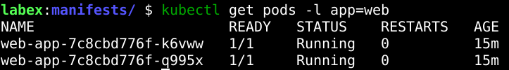

# Deploy applications on Kubernetes

Deploy applications on a Kubernetes cluster using Minikube, explore `kubectl` commands, create a YAML manifest, check deployment status, and access the application with `kubectl proxy`.


| Basic commands    |   function  |
| --------------    |   --------- |
| minikube start    |   start minikube cluster |
| minikube status   |   check minikube status |
| kubectl get nodes |   get active nodes    |
| kubectl get names |    organize Kubernetes clusters |
| kubectl get pods -n kube-system | view pods in specific namespace (-n) |
| kubectl get all   |   get all resources in the default namespace |
| kubectl describe nodes minikube | describe a specific resource type (minikube node) |


General syntax of `kubectl`: 
```
kubectl [command] [TYPE] [NAME] [flags]
```

[command]: Specifies what action you want to perform
| commands    |   function  |
| --------    |   --------  |
| get         | display one or many resources |
| describe    | Show details about a specific resource. |
| create      | Create a new resource    |
| delete      | Delete resources |
| apply       | Apply a configuration to a resource. |

[TYPE]: Specifies the Kubernetes resource type you want to interact with. Common resource types include:
|    type     |   function  |
| --------    |   --------  |
| pods        | The smallest deployable units in Kubernetes. |
| deployments | Manage sets of pods for scaling and updates. |
| services    | Expose applications running in pods.    |
| nodes       | The worker machines in your Kubernetes cluster. |
| namespaces  | Logical groupings of resources. |

[NAME]: The name of a specific resource. This is optional; if you omit the name, kubectl will operate on all resources of the specified type.

[flags]: Optional flags to modify the command's behavior (e.g., -n <namespace>, -o wide).

## Understanding Kubernetes Objects
__Pod__: The most basic unit in Kubernetes. A pod is like a box that can hold one or more containers. These containers within a pod share the same network and storage. Think of a pod as representing a single instance of your application.

__Deployment__: Deployments are used to manage pods. They ensure that a desired number of pod replicas are running at all times. If a pod fails, a deployment will automatically replace it. Deployments also handle updates to your application in a controlled way, like rolling updates.

__Service__: Services provide a stable way to access your application running in pods. Because pods can be created and destroyed, their IP addresses can change. A service provides a fixed IP address and DNS name that always points to the set of pods it manages. This allows other parts of your application, or external users, to reliably access your application without needing to track individual pod IPs.

## YAML Manifest overview

A YAML manifest in Kubernetes is a file written in YAML format that describes the Kubernetes objects you want to create or manage

__Declarative Management__: You describe the desired state of your resources in the YAML file (e.g., "I want 3 replicas of my application running"). Kubernetes then works to make the actual state match your desired state. This is called declarative management.

__Version Control__: YAML files are text-based and can be easily stored in version control systems like Git. This allows you to track changes to your Kubernetes configurations over time, rollback to previous configurations, and collaborate with others.

__Reusability and Portability__: You can reuse YAML manifests across different environments (development, testing, production) with minimal changes. This makes your deployments more consistent and reproducible.


# Create an nginx pod
Name: `nginx-pod.yaml`

```
apiVersion: v1
kind: Pod                   # pod resource
metadata:                   # Contains metadata about the pod such as name and labels
  name: nginx-pod           # This is how you will refer to this pod within Kubernetes
  labels:
    app: nginx
spec:                       # Describes the desired state of the pod
  containers:               # A list of containers will be run within the Pod. Right now we have only one container
    - name: nginx           # Name of the container
      image: nginx:latest
      ports:
        - containerPort: 80
```

After you created the file you need to apply it to your Kubernetes cluster to create the pod:
```
kubectl apply -f nginx-pod.yaml
```

### Now we'll create a Deployment. A Deployment will manage the pods, ensuring that the desired number of replicas are running.

Create a new file  `nginx-deployment.yaml` and paste the code below. After created you should `apply`:

```
apiVersion: apps/v1
kind: Deployment
metadata:
  name: nginx-deployment
  labels:
    app: nginx
spec:
  replicas: 3                 # This defines you want 3 replicas of your pod to be running.
  selector:                   # A selector is used by the Deployment to identify which pods it should manage.
    matchLabels:              # Defines the labels that pods must have to be selected by this deployment.
      app: nginx              # Selected pods with label: nginx
  template:                   # A template defines the pod specification the Deployment will use 
                              # to create new pods. Important: The labels defined here in 
                              # template.metadata. labels must match the selector.matchLabels so 
                              # that the Deployment can manage these pods.
    metadata:
      labels:
        app: nginx
    spec:
      containers:
        - name: nginx
          image: nginx:latest
          ports:
            - containerPort: 80
```

## Create a Manifest 
Create a new file: `web-app.yaml` and paste the following content to it:

```
apiVersion: apps/v1
kind: Deployment
metadata:
  name: web-app
spec:
  replicas: 2
  selector:
    matchLabels:
      app: web
  template:
    metadata:
      labels:
        app: web
    spec:
      containers:
        - name: web
          image: nginx:alpine
          ports:
            - containerPort: 80
---                                     # This manifest defines two Kubernetes resources, 
                                        # this is like a separator.
apiVersion: v1
kind: Service
metadata:
  name: web-service
spec:
  selector:
    app: web                            # The service will target pods that have the label: app: web
  type: ClusterIP                       # The service will be exposed only on internal IP addresses
                                        # within the cluster
  ports:
    - port: 80                          # The port on the Service
      targetPort: 80                    # Port of the target pods the service will forward traffic to.
```

After `apply` it, this will create the Deployment and service \
You can apply it via: `kubectl apply -f web-app.yaml` or `kubectl apply -f .`

You can also use the `--dry-run=client` flag to simulate applying a manifest without actually making changes. \
This is useful if you want to check everything is valid but don't want to confirm or modified.
```
kubectl apply -f web-app.yaml --dry-run=client
```

## Debugging and gathering information
For debugging you can also use:
```
kubectl get deployments
```
Or extend with the `-o wide` parameter which will includes additional columns like CONTAINERS, IMAGES, and SELECTOR, providing more context about the deployment.

For in-depth information use describe:
```
kubectl describe deployment web-app
```

Check status of the service:
```
kubectl get services
```

For more details about a service:
```
kubectl describe service web-service
```

## Access the application using the kubectly proxy
Start the proxy in background
```
kubectl proxy --port=8080 &
```

```
# Get pod names for the 'web-app'
kubectl get pods -l app=web
```

Example output: 



You will use this pod name to construct the API path to access the NGINX web server running in that pod. \
Kubernetes API resources are accessible through specific paths. To access a pod through the kubectl proxy, you need to construct a URL like this:
```
http://localhost:8080/api/v1/namespaces/<namespace>/pods/<pod_name>/proxy/
```

To make it readable create a shell variable and store the pod's name:
```
# Get the name of the first pod with label 'app=web'
POD_NAME=$(kubectl get pods -l app=web -o jsonpath='{.items[0].metadata.name}')
echo $POD_NAME # Optional: print the pod name to verify
```

The complete url will look like the following:
```
http://localhost:8080/api/v1/namespaces/default/pods/${POD_NAME}/proxy
```

